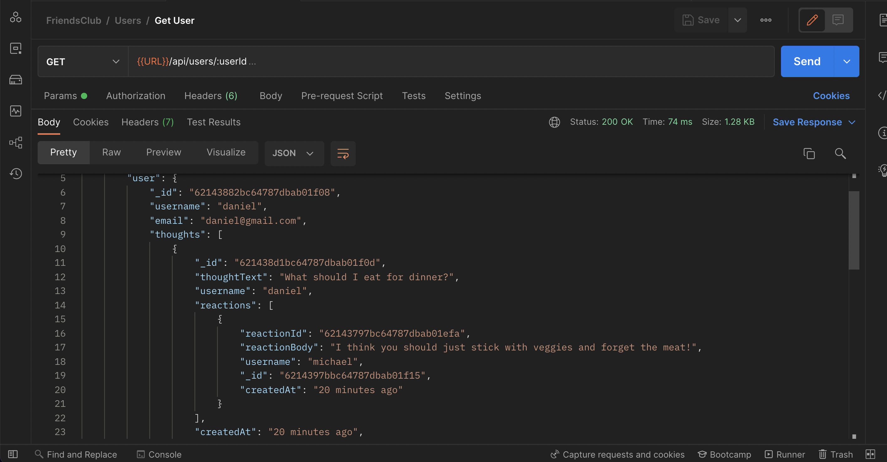

# FriendsClub

## What is it?

An API for a social network web application where users can share their thoughts, react to friends’ thoughts, and create a friend list

It is incomplete right now as there is no authentication, authorization or security practices in place

## Screenshot and links

Click [here](https://drive.google.com/file/d/1aW0P5HcTsZtBDi8q3Jy0XHHxoXwpgUv_/view) for link to instructional video Part 1

Click [here](https://drive.google.com/file/d/1Xh9daym9YuNGxSFdxp1LHUoqY1Aa7NOT/view) for link to instructional video Part 2

Click [here](https://drive.google.com/file/d/1axBro1PThqNoH2SFDIfc5JGk13HobtLA/view) for link to instructional video Part 3



## How to use it

1. Make sure you have Node.js and Mongodb installed as well as a platform for making requests to an API such as Postman or Insomnia
2. If you plan on using a hosted DB like Atlas then go to `server.js` and you will see some instructions, otherwise don't worry about this
3. Open up your command line and type `npm install` in order to install the dependencies (_If you look at the `package.json` file, you will see under devDependencies that I have quite a few packages, feel free to delete them along with the `.eslintrc.json` and `.prettierrc` files_)
4. Startup your local mongo database (_This will differ depending on if you are using mac or windows, check the mongodb docs for how to do this_)
5. In the command line, type `npm run start` in order to start the server
6. In postman or insomnia you will need to type in the route URL for the type of request you want to make, see the **Routes** section for more on how to do this
7. Now you can make a request to create, delete or update a user and you can either find a user by their \_id or you can make a query to find all users currently saved in your database
8. You can save another friend to your friends list or delete them from it
9. You can create a thought (_which is kind of like a comment_), update it or delete it
10. You can create a reaction to someone else's (_or your own_) thought. (_A reaction is kind of like a reply_) . You can also delete your reaction
11. If you'd like to start with some fake data already inputted then you can type in the command line: `node dev-data/data/import-dev-data.js --import` which will automatically import some pre-made data.
12. If you'd like to delete all of the data in your database in one go, you can type in the command line `node dev-data/data/import-dev-data.js --delete`

## Routes

In insomnia or postman type **localhost:3000/** followed by the specific routes and in the body. For the routes that require a request body, you can copy the format shown

### Users

`GET:` `/api/users`

This will get all users

`POST:` `/api/users`

This will create a new user

```JSON
{
    "username": "daniel",
    "email": "daniel@gmail.com"
}

```

`GET:` `/api/users/:id`

This will get a single user, replace `:id` with the `_id` of the user you want

`PUT:` `/api/users/:id`

This will update the user document

In the request body, create a `username` and an `email`

```JSON
{
    "username": "Night",
    "email": "night@gmail.com"
}
```

`DELETE:` `/api/users/:id`

This will delete the user document and all of its associated thoughts (_from the Thought collection_)

Replace `:id` with the users `_id` that you want to delete and in the request body write the `username` of the thoughts you want deleted (_when you create you will assign a username, all thoughts with this username will be deleted_)

```JSON
{
    "username": "daniel"
}
```

`POST:` `/api/users/:userId/friends/:friendId`

This will allow you to add another user to your friends list

Replace `:userId` with one users `_id` and `:friendId` with another users `_id`

## Thoughts

`GET:` `/api/thoughts`

This will get all created thoughts

`POST:` `/api/thoughts`

This will create a thought, in the request body you will require a `thoughtText`, a `username` and a `userId`

The `thoughtText` is what others are going to read, the thought itself

The `username` should be the same one you used when creating the user this thought will be associated to

The `userId` will be the `_id` of the user this thought is associated to

```JSON
{
    "thoughtText": "Studying today!",
    "username": "daniel",
    "userId":"621a7ef9806787156b86c779"
}
```

`GET:` `/api/thoughts/:thoughtId`

This will get a specific thought along with its reactions

Replace `:thoughtId` with the `_id` of the thought you want

`PUT:` `/api/thoughts/:thoughtId`

This will update the Thought document

Replace `:thoughtId` with the thought you want to update

In the request body, enter the new `thoughtText` and the `_id` of the user this thought belongs to

```JSON
{
    "thoughtText": "What should I eat for dinner?",
    "userId": "62143882bc64787dbab01f08"
}
```

`DELETE:` `/api/thoughts/:thoughtId`

This will delete the Thought document

Replace `:thoughtId` with the `_id` of the thought you want deleted

`POST:` `/api/thoughts/:thoughtId/reactions`

This will create a reaction for a specific thought

Replace `:thoughtId` with the `_id` of the thought that you want to leave a reaction on

In the request body, you will need a `username` which is going to be the name of who posted the reaction and a `reactionBody` which is simply the reaction itself

```JSON
{
    "username": "michael",
    "reactionBody":"Try eating some veggies!"
}
```

`DELETE:` `/api/thoughts/:thoughtId/reactions`

This will delete a reaction

Replace `:thoughtId` with the `_id` of the thought that the reaction belongs to

In the request body write the `reactionId` of the reaction you want deleted

```JSON
{
    "reactionId": "621a9508f40d31a2c62b523e"
}
```

## Technologies

HTML, CSS, Javascript, Node.js, Mongoose,

## License

Not under any license

## Contributions

Made by Daniel Arzanipour

## Questions

[My Github](https://github.com/DanielArzani)

If you need to reach me for any additional questions, you can reach me at my [Gmail](mailto:daniel.arzanipour@gmail.com)
